<div align="center">

#  DeepNeumoScan

### 🔬 AI-Powered Pneumonia Detection & Health Assessment Platform


[](https://reactjs.org/)
[](https://www.typescriptlang.org/)
[](https://nodejs.org/)
[](https://tailwindcss.com/)
[](https://vitejs.dev/)

<p align="center">
  <strong>🌐 Multilingual Support: English 🇬🇧 | ಕನ್ನಡ 🇮🇳</strong>
</p>

<p align="center">
  
  
  
</p>

---

### 👩‍💻 Team Members

| Role | Name | 
|------|------|
| 👩‍🎓 **Team Member** | SHIFA |
| 👩‍🎓 **Team Member** | SINCHANA |
| 👩‍🎓 **Team Member** | RASHIKA.N |

### 🛠️ Contributor

<a href="https://github.com/Tanishq-JM">
  
</a>

---

</div>

## 📋 Table of Contents

- [🎯 Overview](#-overview)
- [🏗️ Architecture](#️-architecture)
- [✨ Features](#-features)
- [🚀 Quick Start](#-quick-start)
- [📖 Usage Guide](#-usage-guide)
- [🔌 API Documentation](#-api-documentation)
- [📁 Project Structure](#-project-structure)
- [🛠️ Tech Stack](#️-tech-stack)
- [💾 Data Storage](#-data-storage)
- [🤝 Contributing](#-contributing)

---

## 🎯 Overview

**DeepNeumoScan** is a comprehensive healthcare web application designed to assist users in early pneumonia detection through AI-powered X-ray analysis and symptom-based self-assessments. The platform provides a user-friendly wizard interface for assessments, tracks medical history, and helps locate nearby hospitals.

### 🌟 Key Highlights

| Feature | Description |
|---------|-------------|
| 🤖 **AI Analysis** | Machine learning-based chest X-ray analysis |
| 📝 **Smart Assessments** | Step-by-step wizard for symptom evaluation |
| 📊 **Risk Scoring** | Automated Low/Moderate/High risk classification |
| 🏥 **Hospital Finder** | Locate nearby healthcare facilities |
| 📜 **History Tracking** | Complete medical assessment history |
| 🌍 **Bilingual** | English & Kannada language support |

---

## 🏗️ Architecture

### 🌸 System Architecture Diagram

```mermaid
%%{init: {'theme': 'base', 'themeVariables': { 'primaryColor': '#FFB6C1', 'primaryTextColor': '#333', 'primaryBorderColor': '#FF69B4', 'lineColor': '#DDA0DD', 'secondaryColor': '#E6E6FA', 'tertiaryColor': '#F0FFF0'}}}%%
flowchart TB
    subgraph CLIENT["🖥️ CLIENT LAYER"]
        direction TB
        UI["⚛️ React 18 + TypeScript"]
        VITE["⚡ Vite Dev Server"]
        TAILWIND["🎨 TailwindCSS"]
        ROUTER["🔀 React Router v6"]
    end

    subgraph FEATURES["📱 FEATURES"]
        direction TB
        SELF["📝 Self Assessment"]
        XRAY["🔬 X-Ray Scanner"]
        CURE["💊 Curing Assessment"]
        HOSP["🏥 Hospital Tracker"]
        HIST["📜 History"]
    end

    subgraph CONTEXT["🔄 STATE MANAGEMENT"]
        direction LR
        AUTH["🔐 AuthContext"]
        LANG["🌍 LanguageContext"]
        HISTORY["📋 HistoryContext"]
    end

    subgraph SERVER["⚙️ SERVER LAYER"]
        direction TB
        EXPRESS["🚂 Express.js"]
        JWT["🔑 JWT Auth"]
        MULTER["📤 Multer Upload"]
        ROUTES["🛤️ API Routes"]
    end

    subgraph STORAGE["💾 DATA LAYER"]
        direction TB
        USERS[("👥 users.json")]
        ASSESS[("📊 assessments.json")]
        XRAYDB[("🫁 xray_results.json")]
        UPLOADS[("🖼️ uploads/")]
    end

    subgraph AI["🤖 AI LAYER"]
        direction TB
        TF["🧠 TensorFlow.js"]
        KNN["📈 Mock KNN"]
        SVM["📉 Mock SVM"]
    end

    CLIENT --> FEATURES
    FEATURES --> CONTEXT
    CONTEXT --> SERVER
    SERVER --> STORAGE
    FEATURES --> AI

    style CLIENT fill:#FFB6C1,stroke:#FF69B4,stroke-width:3px,color:#333
    style FEATURES fill:#E6E6FA,stroke:#DDA0DD,stroke-width:3px,color:#333
    style CONTEXT fill:#B0E0E6,stroke:#87CEEB,stroke-width:3px,color:#333
    style SERVER fill:#98FB98,stroke:#90EE90,stroke-width:3px,color:#333
    style STORAGE fill:#FAFAD2,stroke:#F0E68C,stroke-width:3px,color:#333
    style AI fill:#DDA0DD,stroke:#DA70D6,stroke-width:3px,color:#333
```



### 🌷 Data Flow Diagram

```mermaid
%%{init: {'theme': 'base', 'themeVariables': { 'primaryColor': '#98FB98', 'primaryTextColor': '#333', 'lineColor': '#FFB6C1', 'actorBkg': '#E6E6FA', 'actorBorder': '#DDA0DD', 'signalColor': '#FFB6C1'}}}%%
sequenceDiagram
    autonumber
    participant U as 👤 User
    participant F as ⚛️ Frontend
    participant A as 🔐 Auth Middleware
    participant B as ⚙️ Backend API
    participant D as 💾 JSON Database
    participant AI as 🤖 AI Engine

    rect rgb(255, 182, 193, 0.2)
        Note over U,D: 🌸 Authentication Flow
        U->>F: Login/Signup Request
        F->>B: POST /api/auth/login
        B->>D: Verify Credentials
        D-->>B: User Data
        B-->>F: JWT Token + User Info
        F->>F: Store in LocalStorage
    end

    rect rgb(230, 230, 250, 0.3)
        Note over U,AI: 🌷 Assessment Flow
        U->>F: Complete Assessment Wizard
        F->>A: Request + JWT Token
        A->>A: Verify Token
        A->>B: Forward Request
        B->>AI: Process Symptoms
        AI-->>B: Risk Score
        B->>D: Save Assessment
        D-->>B: Confirmation
        B-->>F: Result + Recommendations
        F-->>U: Display Results
    end

    rect rgb(176, 224, 230, 0.3)
        Note over U,AI: 🌺 X-Ray Analysis Flow
        U->>F: Upload X-Ray Image
        F->>B: POST /api/xray/upload
        B->>B: Save Image (Multer)
        B->>AI: Analyze Image
        AI-->>B: Prediction Result
        B->>D: Save X-Ray Result
        B-->>F: Analysis Complete
        F-->>U: Show Diagnosis
    end
```



### 🌻 Authentication Flow

```mermaid
%%{init: {'theme': 'base', 'themeVariables': { 'primaryColor': '#FAFAD2', 'primaryTextColor': '#333', 'lineColor': '#FFB6C1'}}}%%
flowchart LR
    subgraph LOGIN["🌸 Login Process"]
        A["📧 Enter Email"] --> B["🔑 Enter Password"]
        B --> C{"✅ Valid?"}
        C -->|Yes| D["🎫 Generate JWT"]
        C -->|No| E["❌ Error Message"]
        D --> F["💾 Store Token"]
        F --> G["🏠 Redirect Home"]
    end

    subgraph PROTECTED["🌷 Protected Routes"]
        H["📄 Access Page"] --> I{"🔍 Token Exists?"}
        I -->|Yes| J{"⏰ Token Valid?"}
        I -->|No| K["↩️ Redirect Login"]
        J -->|Yes| L["✅ Allow Access"]
        J -->|No| M["🗑️ Clear Storage"]
        M --> K
    end

    LOGIN --> PROTECTED

    style LOGIN fill:#FFE4E1,stroke:#FFB6C1,stroke-width:3px,color:#333
    style PROTECTED fill:#E0FFFF,stroke:#B0E0E6,stroke-width:3px,color:#333
```



---

## ✨ Features

### 📝 Self-Assessment Wizard
> **Step-by-step symptom evaluation with intelligent risk scoring**

- 🔢 **10+ Comprehensive Questions** covering all pneumonia symptoms
- 📊 **Automatic Risk Calculation**: Low / Moderate / High
- 💡 **Personalized Recommendations** based on results
- 🎯 **One Question at a Time** - Easy wizard interface

### 🔬 X-Ray Scan Analysis
> **AI-powered chest X-ray analysis for pneumonia detection**

- 📤 **Easy Image Upload** - Drag & drop or click to upload
- 🤖 **ML-Based Analysis** using TensorFlow.js
- 📈 **Confidence Scoring** with probability percentages
- 🔄 **Fallback System** - Mock KNN/SVM when TensorFlow unavailable

### 💊 Curing Assessment
> **Track your recovery progress over time**

- 📋 **Recovery Questionnaire** with medical questions
- 📈 **Progress Tracking** - Monitor improvement
- 📅 **Historical Comparison** with previous assessments

### 🏥 Hospital Tracker
> **Find nearby healthcare facilities**

- 🗺️ **Location-Based Search** using geolocation
- 📍 **Hospital Details** including contact info
- 🚗 **Distance Calculation** from your location

### 📜 History Dashboard
> **Complete medical record management**

- 📊 **All Assessments** - Self, Curing, X-Ray results
- 🗓️ **Date Organized** - Easy navigation
- 🗑️ **Delete Records** - Manage your data
- 📱 **Responsive Cards** - Beautiful UI

### 🌍 Language Support
> **Full bilingual interface**

| Language | Code | Status |
|----------|------|--------|
| 🇬🇧 English | `en` | ✅ Complete |
| 🇮🇳 ಕನ್ನಡ (Kannada) | `kn` | ✅ Complete |

---

## 🚀 Quick Start

### 📋 Prerequisites

| Requirement | Version | Download |
|-------------|---------|----------|
| Node.js | ≥ 18.x | [nodejs.org](https://nodejs.org/) |
| npm | ≥ 9.x | Included with Node.js |
| Git | Latest | [git-scm.com](https://git-scm.com/) |

### ⚡ Installation

#### 🖥️ Windows (PowerShell)

```powershell
# Clone the repository
git clone https://github.com/yourusername/deepneumoscan.git
cd deepneumoscan

# Install & Start Backend
cd backend
npm install
npm run dev

# Open new terminal for Frontend
cd frontend
npm install
npm run dev
```

#### 🍎 macOS / 🐧 Linux (Bash)

```bash
# Clone the repository
git clone https://github.com/yourusername/deepneumoscan.git
cd deepneumoscan

# Install & Start Backend
cd backend && npm install && npm run dev

# Open new terminal for Frontend
cd frontend && npm install && npm run dev
```

### 🌐 Access Points

| Service | URL | Description |
|---------|-----|-------------|
| 🖥️ **Frontend** | `http://localhost:5173` | React Application |
| ⚙️ **Backend** | `http://localhost:5000` | Express API Server |
| 📡 **API Base** | `http://localhost:5000/api` | REST Endpoints |

### 🔑 Test Account

```
📧 Email:    test@example.com
🔑 Password: password123
```

> 💡 **Tip**: You can also create a new account via the Signup page!

---

## 📖 Usage Guide

### 1️⃣ Getting Started

```mermaid
%%{init: {'theme': 'base', 'themeVariables': { 'primaryColor': '#FFB6C1', 'lineColor': '#DDA0DD'}}}%%
flowchart LR
    A["🏠 Home Page"] --> B{"👤 Logged In?"}
    B -->|No| C["🔐 Login/Signup"]
    B -->|Yes| D["📱 Dashboard"]
    C --> D
    D --> E["🎯 Choose Feature"]
    
    style A fill:#FFB6C1,stroke:#FF69B4,stroke-width:2px,color:#333
    style B fill:#E6E6FA,stroke:#DDA0DD,stroke-width:2px,color:#333
    style C fill:#B0E0E6,stroke:#87CEEB,stroke-width:2px,color:#333
    style D fill:#98FB98,stroke:#90EE90,stroke-width:2px,color:#333
    style E fill:#FAFAD2,stroke:#F0E68C,stroke-width:2px,color:#333
```



### 2️⃣ Self-Assessment Flow

1. **Navigate** to Self-Assessment page
2. **Answer** each question one at a time
3. **Click Next** to proceed through the wizard
4. **Submit** when all questions are answered
5. **View Results** with risk level and recommendations

### 3️⃣ X-Ray Analysis Flow

1. **Navigate** to X-Ray Scan page
2. **Upload** a chest X-ray image (JPEG/PNG)
3. **Wait** for AI analysis
4. **Review** the prediction results
5. **Save** to your history

### 4️⃣ View History

1. **Navigate** to History page
2. **Browse** past assessments and X-ray results
3. **Click** on any record for details
4. **Delete** records you no longer need (🗑️ button)

---

## 🔌 API Documentation

### 🔐 Authentication Endpoints

| Method | Endpoint | Description | Body |
|--------|----------|-------------|------|
| `POST` | `/api/auth/signup` | Register new user | `{name, email, password}` |
| `POST` | `/api/auth/login` | Login user | `{email, password}` |

### 📝 Assessment Endpoints

| Method | Endpoint | Description | Auth |
|--------|----------|-------------|------|
| `GET` | `/api/assessments` | Get all assessments | 🔑 Required |
| `POST` | `/api/assessments` | Create assessment | 🔑 Required |
| `DELETE` | `/api/assessments/:id` | Delete assessment | 🔑 Required |

### 🔬 X-Ray Endpoints

| Method | Endpoint | Description | Auth |
|--------|----------|-------------|------|
| `GET` | `/api/xray` | Get all X-ray results | 🔑 Required |
| `POST` | `/api/xray/upload` | Upload & analyze X-ray | 🔑 Required |
| `DELETE` | `/api/xray/:id` | Delete X-ray result | 🔑 Required |

### 🏥 Hospital Endpoints

| Method | Endpoint | Description | Auth |
|--------|----------|-------------|------|
| `GET` | `/api/hospitals` | Get nearby hospitals | 🔑 Required |

### 📜 History Endpoints

| Method | Endpoint | Description | Auth |
|--------|----------|-------------|------|
| `GET` | `/api/history` | Get complete history | 🔑 Required |

### 📋 Request Headers

```http
Authorization: Bearer <your_jwt_token>
Content-Type: application/json
```

### 📤 Example Request

```javascript
// Self-Assessment Submission
const response = await fetch('http://localhost:5000/api/assessments', {
  method: 'POST',
  headers: {
    'Authorization': `Bearer ${token}`,
    'Content-Type': 'application/json'
  },
  body: JSON.stringify({
    type: 'self',
    answers: {
      fever: 'yes',
      cough: 'severe',
      breathing: 'difficult',
      // ... more answers
    }
  })
});
```

---

## 📁 Project Structure

```
📦 DeepNeumoScan/
├── 📂 backend/
│   ├── 📄 server.ts              # Express server entry
│   ├── 📄 package.json           # Backend dependencies
│   ├── 📄 tsconfig.json          # TypeScript config
│   ├── 📂 config/
│   │   └── 📄 db.ts              # Database configuration
│   ├── 📂 middleware/
│   │   └── 📄 auth.ts            # JWT authentication
│   ├── 📂 models/
│   │   ├── 📄 Assessment.ts      # Assessment model
│   │   ├── 📄 History.ts         # History model
│   │   ├── 📄 User.ts            # User model
│   │   └── 📄 XrayResult.ts      # X-Ray result model
│   ├── 📂 routes/
│   │   ├── 📄 assessments.ts     # Assessment API
│   │   ├── 📄 auth.ts            # Auth API
│   │   ├── 📄 history.ts         # History API
│   │   ├── 📄 hospitals.ts       # Hospital API
│   │   └── 📄 xray.ts            # X-Ray API
│   └── 📂 data/                  # JSON database files
│       ├── 📄 users.json
│       ├── 📄 assessments.json
│       └── 📄 xray_results.json
│
├── 📂 frontend/
│   ├── 📄 index.html             # HTML entry point
│   ├── 📄 package.json           # Frontend dependencies
│   ├── 📄 vite.config.ts         # Vite configuration
│   ├── 📄 tailwind.config.js     # Tailwind configuration
│   ├── 📄 tsconfig.json          # TypeScript config
│   └── 📂 src/
│       ├── 📄 App.tsx            # Main React component
│       ├── 📄 main.tsx           # React entry point
│       ├── 📄 index.css          # Global styles
│       ├── 📂 components/
│       │   ├── 📄 Layout.tsx
│       │   ├── 📄 LanguageToggle.tsx
│       │   └── 📄 ProtectedRoute.tsx
│       ├── 📂 context/
│       │   ├── 📄 AuthContext.tsx
│       │   ├── 📄 HistoryContext.tsx
│       │   └── 📄 LanguageContext.tsx
│       ├── 📂 hooks/
│       │   ├── 📄 useAuth.ts
│       │   └── 📄 useLanguage.ts
│       ├── 📂 i18n/
│       │   ├── 📄 en.json        # English translations
│       │   └── 📄 kn.json        # Kannada translations
│       ├── 📂 pages/
│       │   ├── 📄 Home.tsx
│       │   ├── 📄 Login.tsx
│       │   ├── 📄 Signup.tsx
│       │   ├── 📄 SelfAssessment.tsx
│       │   ├── 📄 CuringAssessment.tsx
│       │   ├── 📄 XRayScan.tsx
│       │   ├── 📄 History.tsx
│       │   └── 📄 HospitalTracker.tsx
│       ├── 📂 services/
│       │   ├── 📄 api.ts         # API service layer
│       │   └── 📄 ai.ts          # AI prediction service
│       └── 📂 types/
│           └── 📄 index.ts       # TypeScript types
│
└── 📄 README.md                  # This file
```

---

## 🛠️ Tech Stack

### 🎨 Frontend

| Technology | Purpose | Version |
|------------|---------|---------|
| ⚛️ **React** | UI Library | 18.3.1 |
| 📘 **TypeScript** | Type Safety | 5.5.3 |
| ⚡ **Vite** | Build Tool | 5.3.1 |
| 🎨 **TailwindCSS** | Styling | 3.4.18 |
| 🔀 **React Router** | Navigation | 6.x |
| 🎯 **Lucide React** | Icons | Latest |
| 🧠 **TensorFlow.js** | ML in Browser | Latest |

### ⚙️ Backend

| Technology | Purpose | Version |
|------------|---------|---------|
| 🟢 **Node.js** | Runtime | ≥18.x |
| 🚂 **Express.js** | Web Framework | 4.21.2 |
| 📘 **TypeScript** | Type Safety | Latest |
| 🔑 **JWT** | Authentication | 9.0.2 |
| 📤 **Multer** | File Upload | Latest |
| 🔄 **ts-node-dev** | Dev Server | Latest |

### 💾 Data Layer

| Technology | Purpose |
|------------|---------|
| 📄 **JSON Files** | Database Storage |
| 📁 **File System** | Image Storage |

---

## 💾 Data Storage

### 📁 Database Files Location

```
backend/data/
├── 📄 users.json         # User accounts & credentials
├── 📄 assessments.json   # Self & Curing assessments
└── 📄 xray_results.json  # X-Ray analysis results
```

### 🖼️ Image Storage

```
backend/uploads/
└── 🖼️ *.jpg/*.png        # Uploaded X-Ray images
```

### 🔄 Reset Data

To reset all application data:

```powershell
# Navigate to backend data folder
cd backend/data

# Delete all JSON files
Remove-Item *.json

# Restart backend - files will auto-regenerate
```

---

## 🤝 Contributing

We welcome contributions! Here's how you can help:

1. 🍴 **Fork** the repository
2. 🌿 **Create** a feature branch (`git checkout -b feature/amazing-feature`)
3. 💾 **Commit** your changes (`git commit -m 'Add amazing feature'`)
4. 📤 **Push** to the branch (`git push origin feature/amazing-feature`)
5. 🔃 **Open** a Pull Request

---

<div align="center">

---

### 🌸 Made with Love in India 🇮🇳


**Empowering early pneumonia detection through AI**

---

### 👩‍💻 Our Amazing Team

<table align="center">
  <tr>
    <td align="center"><b>👩‍🎓 SHIFA</b><br/><sub>Team Member</sub></td>
    <td align="center"><b>👩‍🎓 SINCHANA</b><br/><sub>Team Member</sub></td>
    <td align="center"><b>👩‍🎓 RASHIKA.N</b><br/><sub>Team Member</sub></td>
  </tr>
</table>

### 🛠️ Contributor

<a href="https://github.com/Tanishq-JM">
  
</a>

---

⭐ **Star this repo** if you find it helpful!

[](https://github.com/Tanishq-JM)
[]()

</div>
